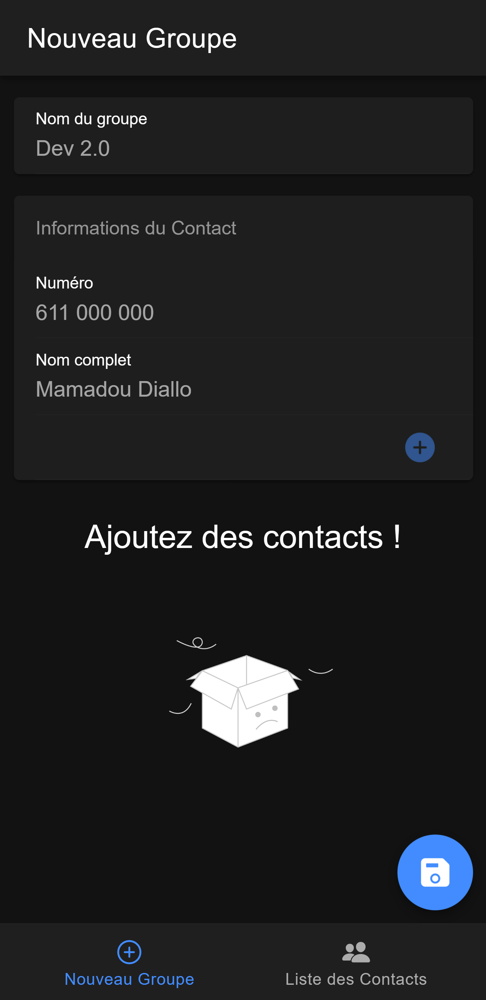
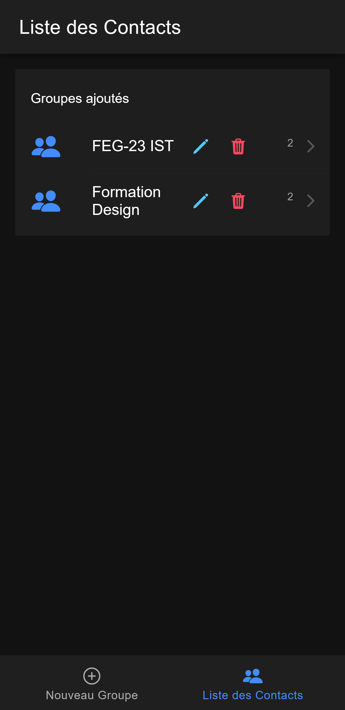
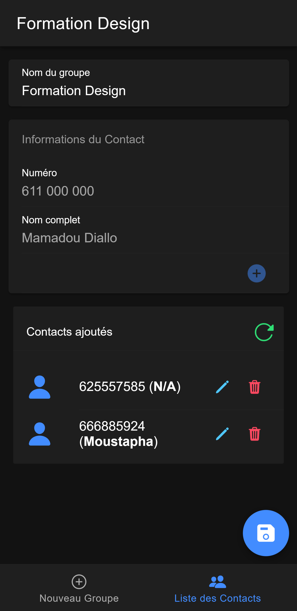

# Contact Saver
---

This document is available in those languages

[![French][French-img]][French-url] [![English][English-img-current]][English-url]

---

<!-- PROJECT SHIELDS -->
<!--
*** I'm using markdown "reference style" links for readability.
*** Reference links are enclosed in brackets [ ] instead of parentheses ( ).
*** See the bottom of this document for the declaration of the reference variables
*** for contributors-url, forks-url, etc. This is an optional, concise syntax you may use.
*** https://www.markdownguide.org/basic-syntax/#reference-style-links
-->
[![Contributors][contributors-shield]][contributors-url] [![Forks][forks-shield]][forks-url] [![Stargazers][stars-shield]][stars-url] [![Issues][issues-shield]][issues-url] [![LinkedIn][linkedin-shield]][linkedin-url]

<!-- PROJECT LOGO -->
 

  <!--  -->

<h3 align="center">Contact Saver</h3>

  

    Contact Saver is a mobile application intended to help you to easily manage new contacts. Don't do it the old way by saving a contact one by one, rather use our app and save your time. This is the best solution if you want to keep your notebook organised and access related contact with ease !
     
    <a href="https://github.com/moustaphaotf/contact-saver"><strong>Explore the docs »</strong></a>
     
     
    <a href="https://github.com/moustaphaotf/contact-saver">View Demo</a>
    ·
    <a href="https://github.com/moustaphaotf/contact-saver/issues">Report Bug</a>
    ·
    <a href="https://github.com/moustaphaotf/contact-saver/issues">Request Feature</a>
  

<!-- TABLE OF CONTENTS -->

  
Table of Contents

  <ol>
    <li>
      <a href="#about-the-project">About The Project</a>
      <ul>
        <li><a href="#built-with">Built With</a></li>
      </ul>
    </li>
    <li>
      <a href="#getting-started">Getting Started</a>
      <ul>
        <li><a href="#prerequisites">Prerequisites</a></li>
        <li><a href="#installation">Installation</a></li>
      </ul>
    </li>
    <li><a href="#contributing">Contributing</a></li>
    <li><a href="#contact">Contact</a></li>
  </ol>

<!-- ABOUT THE PROJECT -->
## About The Project

<table>
    <tr>
        <td></td>
        <td></td>
        <td></td>
    </tr>
</table>

(<a href="#readme-top">back to top</a>)

### Built With

* [![Ionic][Ionic.js]][Ionic-url]
* [![React][React.js]][React-url]
* [![JavaScript][JavaScript.com]][TypeScript-url]
* [![TypeScript][TypeScript.js]][TypeScript-url]
* [![CSS][CSS.com]][CSS-url]

(<a href="#readme-top">back to top</a>)

<!-- GETTING STARTED -->
## Getting Started
As a growing project, we are highly looking for your contribution in any form they could be, either you suggest an update or you help the developer team. Your help will be of great value !

### Prerequisites

### Installation

Head to the [release page](https://github.com/moustaphaotf/contact-saver/releases) to checkout our latest version.

You can also directly download the [Android version](https://github.com/moustaphaotf/contact-saver/releases/download/v1.0.0/contact-saver-main-d813b6-release-1.0.0.apk) of the **Contact Saver**.

We soon will upload the app to the well known stores for your convenience!

(<a href="#readme-top">back to top</a>)

<!-- CONTRIBUTING -->
## Contributing

Contributions are what make the open source community such an amazing place to learn, inspire, and create. Any contributions you make are **greatly appreciated**.

If you have a suggestion that would make this better, please fork the repo and create a pull request. You can also simply open an issue with the tag "enhancement".
Don't forget to give the project a star! Thanks again!

1. Fork the Project
1. Create your Feature Branch (`git checkout -b feature/AmazingFeature`)
1. Commit your Changes (`git commit -m 'Add some AmazingFeature'`)
1. Push to the Branch (`git push origin feature/AmazingFeature`)
1. Open a Pull Request

> We are eager to get your PRs !

(<a href="#readme-top">back to top</a>)

<!-- CONTACT -->
## Contact

Mamadou Moustapha Diallo - [@moustaphaotf](https://twitter.com/moustaphaotf) - moustaphaotf@gmail.com

Project Link: [https://github.com/moustaphaotf/contact-saver](https://github.com/moustaphaotf/contact-saver)

(<a href="#readme-top">back to top</a>)

<!-- ACKNOWLEDGMENTS -->
## Acknowledgments

(<a href="#readme-top">back to top</a>)

<!-- MARKDOWN LINKS & IMAGES -->
<!-- https://www.markdownguide.org/basic-syntax/#reference-style-links -->
[contributors-shield]: https://img.shields.io/github/contributors/moustaphaotf/contact-saver.svg?style=for-the-badge
[contributors-url]: https://github.com/moustaphaotf/contact-saver/graphs/contributors
[forks-shield]: https://img.shields.io/github/forks/moustaphaotf/contact-saver.svg?style=for-the-badge
[forks-url]: https://github.com/moustaphaotf/contact-saver/network/members
[stars-shield]: https://img.shields.io/github/stars/moustaphaotf/contact-saver.svg?style=for-the-badge
[stars-url]: https://github.com/moustaphaotf/contact-saver/stargazers
[issues-shield]: https://img.shields.io/github/issues/moustaphaotf/contact-saver.svg?style=for-the-badge
[issues-url]: https://github.com/moustaphaotf/contact-saver/issues
[linkedin-shield]: https://img.shields.io/badge/-LinkedIn-black.svg?style=for-the-badge&logo=linkedin&colorB=555
[linkedin-url]: https://linkedin.com/in/moustaphaotf
[JavaScript-url]: https://developer.mozilla.org/en-US/docs/Web/javascript
[JavaScript.com]:  https://img.shields.io/badge/JavaScript-000000?style=for-the-badge&logo=javascript
[TypeScript-url]: https://www.typescriptlang.org/
[TypeScript.js]:  https://img.shields.io/badge/TypeScript-000000?style=for-the-badge&logo=typescript
[Ionic-url]: https://ionicframework.com/
[Ionic.js]: https://img.shields.io/badge/IONIC-000000?style=for-the-badge&logo=ionic
[React.js]: https://img.shields.io/badge/React-000000?style=for-the-badge&logo=react&logoColor=61DAFB
[React-url]: https://reactjs.org/
[CSS-url]: https://www.w3.org/Style/CSS
[CSS.com]:  https://img.shields.io/badge/CSS-000000?style=for-the-badge&logo=css3
[French-img]: https://img.shields.io/badge/FR-Fran%C3%A7ais-red
[French-img-current]: https://img.shields.io/badge/FR-Fran%C3%A7ais-blue
[French-url]: ./README-fr.md
[English-img]: https://img.shields.io/badge/EN-English%20%20%20-red
[English-img-current]: https://img.shields.io/badge/EN-English%20%20%20-blue
[English-url]: ./README.md
